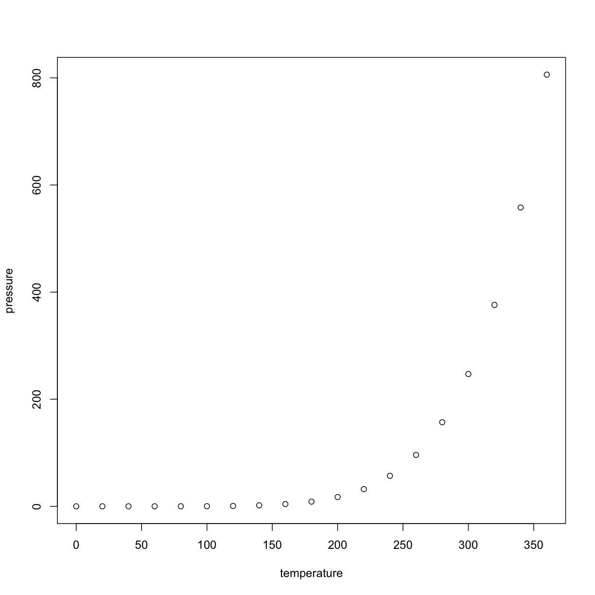

---
# Please do not edit this file directly; it is auto generated.
# Instead, please edit 01-test.md in _episodes_rmd/
title: "Analyzing Patient Data"
teaching: 45
exercises: 0
questions:
- "How do I read data into R?"
- "How do I assign variables?"
- "What is a data frame?"
- "How do I access subsets of a data frame?"
- "How do I calculate simple statistics like mean and median?"
- "Where can I get help?"
- "How can I plot my data?"
objectives:
- "Read tabular data from a file into a program."
- "Assign values to variables."
- "Select individual values and subsections from data."
- "Perform operations on a data frame of data."
- "Display simple graphs."
keypoints:
- "Use `variable <- value` to assign a value to a variable in order to record it in memory."
- "Objects are created on demand whenever a value is assigned to them."
- "The function `dim` gives the dimensions of a data frame."
- "Use `object[x, y]` to select a single element from a data frame."
- "Use `from:to` to specify a sequence that includes the indices from `from` to `to`."
- "All the indexing and subsetting that works on data frames also works on vectors."
- "Use `#` to add comments to programs."
- "Use `mean`, `max`, `min` and `sd` to calculate simple statistics."
- "Use `apply` to calculate statistics across the rows or columns of a data frame."
- "Use `plot` to create simple visualizations."
source: Rmd
---

## R Markdown

This is an R Markdown document. Markdown is a simple formatting syntax for authoring HTML, PDF, and MS Word documents. For more details on using R Markdown see <http://rmarkdown.rstudio.com>.

When you click the **Knit** button a document will be generated that includes both content as well as the output of any embedded R code chunks within the document. You can embed an R code chunk like this:

~~~
summary(cars)
~~~
{: .language-r}

~~~
     speed           dist       
 Min.   : 4.0   Min.   :  2.00  
 1st Qu.:12.0   1st Qu.: 26.00  
 Median :15.0   Median : 36.00  
 Mean   :15.4   Mean   : 42.98  
 3rd Qu.:19.0   3rd Qu.: 56.00  
 Max.   :25.0   Max.   :120.00  
~~~
{: .output}

## Including Plots

You can also embed plots, for example:

Note that the `echo = FALSE` parameter was added to the code chunk to prevent printing of the R code that generated the plot.
